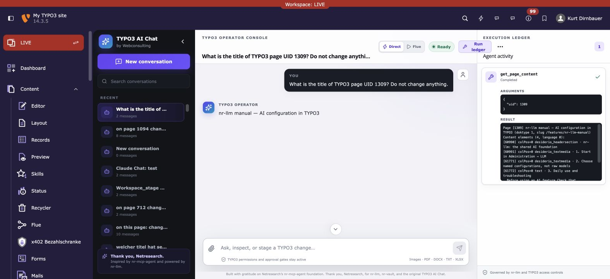
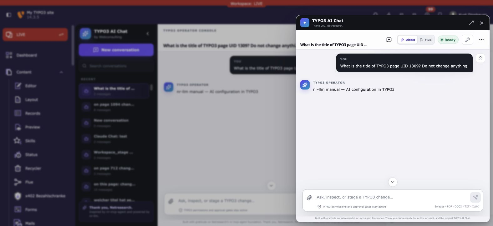

# TYPO3 AI Chat by Webconsulting

[](https://github.com/dirnbauer/typo3-ai-chat/actions)

A modern, governed operator console for the TYPO3 backend. Editors can converse
with their installation, inspect live TYPO3 context, execute nr-llm tools, review
every tool argument/result, approve sensitive work, and optionally dispatch
durable MCP workflows through Webconsulting Flue.

This project is derived from
[Netresearch nr-mcp-agent](https://github.com/netresearch/t3x-nr-mcp-agent).
Thank you, Netresearch, for publishing the original extension, for the excellent
nr-llm and nr-vault foundations, and for making this work possible. The upstream
Git history is retained in this repository and the detailed attribution is in
[THANKS-NETRESEARCH.md](THANKS-NETRESEARCH.md).

## What is different

- **Operator console, not a bubble widget** — conversation rail, focused thread,
  live status, and a separate execution ledger.
- **Real governed execution** — tool calls run as the authenticated TYPO3 actor.
  Approval-required calls pause visibly and can be allowed once or denied.
- **MCP through Flue** — optional durable workflows use Flue's MCP token minting,
  tool allowlists, run store, and draft-workspace write safety.
- **Rich attachments** — multiple PNG/JPEG/WebP images, PDFs, DOCX, TXT and XLSX
  files, with image thumbnails and an inline first-page PDF preview before send.
- **Modern chat foundation** — the interface uses
  [assistant-ui](https://www.assistant-ui.com/) with a custom TYPO3 runtime,
  React 19, Vite and Lucide. It does not require Vercel or a JavaScript AI
  backend at runtime.
- **Two native surfaces** — the same modern conversation and execution UI is
  available as a fast top-right inline drawer and as a spacious Tools module.
- **TYPO3-native authority** — TYPO3 permissions, nr-llm governance, provider
  configuration, FAL validation and server-side document extraction remain the
  source of truth.
- **Safe migration** — an idempotent command copies conversations and MCP server
  records from nr-mcp-agent before the old extension is removed.



The compact toolbar surface keeps the same conversations and governed execution
controls available without leaving the current TYPO3 module:



## Architecture

```text
assistant-ui operator console
        |
        +-- Direct lane --> TYPO3 AJAX --> nr-llm AgentRuntime
        |                                  |-- tool registry
        |                                  |-- guardrails
        |                                  `-- human approval/resume
        |
        `-- Flue lane ----> Webconsulting Flue control plane
                                           |-- durable run
                                           |-- MCP allowlist + PAT
                                           `-- draft-workspace writes
```

There is deliberately no unrestricted shell executor. “Cursor-like” means that
the model can select well-described tools, show its intent and arguments, and
continue after a human decision. It does not mean bypassing TYPO3 permissions.

## Requirements

- PHP 8.2+
- TYPO3 13.4 or 14
- `netresearch/nr-llm ^0.25`
- a configured nr-llm Task
- optional: `netresearch/nr-vault`
- optional: `hn/typo3-mcp-server`
- optional on TYPO3 14/PHP 8.3+: `webconsulting/flue`

## Installation

```bash
composer require webconsulting/typo3-ai-chat
vendor/bin/typo3 extension:setup
```

Then open **Admin Tools → Settings → Extension Configuration → Webconsulting
TYPO3 AI Chat** and set:

| Setting | Purpose |
|---|---|
| `llmTaskUid` | nr-llm Task used by the direct operator lane |
| `processingStrategy` | `exec` for one process per turn or `worker` |
| `allowedGroups` | Optional comma-separated backend group UIDs |
| `maxMessageLength` | Server-side request bound |
| `maxActiveConversationsPerUser` | Concurrency bound |
| `enableFlue` | Expose the durable Flue lane |
| `flueFlowUid` | Existing, governed Flue flow to trigger |

The backend module appears under **Tools → TYPO3 AI Chat**.

## Safe replacement of nr-mcp-agent

Keep both extensions installed during verification:

```bash
vendor/bin/typo3 extension:setup
vendor/bin/typo3 webconsulting-ai-chat:migrate-nr-mcp-agent
```

The migration command:

- copies `tx_nrmcpagent_conversation` rows without overwriting target UIDs;
- copies configured MCP server records;
- is safe to run repeatedly;
- leaves all source data untouched.

Only after the new module, conversations, uploads, tool execution and approvals
have been verified should the original package be removed:

```bash
composer remove netresearch/nr-mcp-agent
vendor/bin/typo3 extension:setup
```

Thank you again to Netresearch: retaining and migrating the original data is a
first-class requirement, not an afterthought.

## Attachments

Upload validation is performed twice: the browser provides the preview and the
TYPO3 endpoint verifies size, actual MIME type, FAL permissions and document
readability. Files are stored per backend user below
`fileadmin/typo3-ai-chat/<be-user-uid>/`.

| Format | Handling |
|---|---|
| PNG, JPEG, WebP | Native vision when the configured provider supports it |
| PDF | Native document input or server-side text extraction |
| DOCX | Native document input or PHPWord extraction |
| TXT | Server-side text extraction |
| XLSX | PhpSpreadsheet extraction when installed |

The current server limit is 20 MB per file and five files per conversation.

## Flue workflow lane

The Flue lane is shown only when `webconsulting/flue` is installed,
`enableFlue=1`, and `flueFlowUid` points to a flow. The operator supplies a page
UID. Flue remains responsible for:

- resolving the page/workspace context;
- exporting Agent Skills;
- minting a short-lived MCP PAT;
- retrieving the provider key from nr-vault;
- enforcing the flow's MCP tool allowlist;
- keeping writes in a draft workspace;
- persisting the durable run and its event stream.

The chat mirrors the final Flue output and adds the run to its execution ledger.

## Frontend development

The built bundle is committed so TYPO3 installations do not need Node.js.

```bash
npm install
npm run build
npm run test:js
```

Production dependencies have no known npm audit findings at the time of this
release (`npm audit --omit=dev`). The existing test toolchain may report
transitive development-only advisories and should be reviewed with each update.

## Quality

```bash
composer validate --strict
composer ci:phpstan
composer ci:cgl
composer ci:tests
npm run build
npm run test:js
```

## Credits — thank you, Netresearch

The original architecture, conversation lifecycle, FAL upload endpoint,
document extractors, worker/exec processing modes and much of the PHP test
foundation came from Netresearch's GPL-licensed nr-mcp-agent. Webconsulting's
replacement keeps the upstream history and copyright notices.

Thank you to **Netresearch DTT GmbH** for:

- [nr-mcp-agent](https://github.com/netresearch/t3x-nr-mcp-agent);
- [nr-llm](https://github.com/netresearch/t3x-nr-llm);
- [nr-vault](https://github.com/netresearch/t3x-nr-vault);
- investing in open TYPO3 AI infrastructure.

Thank you, Netresearch — in the README, in the TYPO3 backend, in the manuals,
in package metadata, and in the preserved source history.

Also thank you to [hauptsache.net](https://hauptsache.net/) for
[`hn/typo3-mcp-server`](https://github.com/hauptsache-net/typo3-mcp-server).

## License

GPL-2.0-or-later, matching the original extension. See [LICENSE](LICENSE) and
[THANKS-NETRESEARCH.md](THANKS-NETRESEARCH.md).
